---
<p align="center">
  <a href="http://nestjs.com/" target="blank"></a>
</p>

# 🏍️ MyMotoFinances API
### *The Financial Intelligence Brain for Gig-Economy Riders*

<p align="center">
  
  
  
  
  
  
</p>

---

## 📖 Overview

**MyMotoFinances** is a specialized financial ecosystem designed for motorcycle taxi drivers (Uber, DiDi, InDrive). This API serves as the core orchestrator, solving the problem of fragmented income by unifying multiple ride-sharing platforms into a single, automated financial dashboard.

### The Problem
Drivers struggle to track net profit due to:
1.  **Scattered Income:** Earnings spread across multiple apps and cash.
2.  **Invisible Costs:** Fuel and maintenance expenses are often not deducted in real-time.
3.  **Lack of Discipline:** Difficult to save for fixed debts (Rent, Bike Payments) when income is daily and volatile.

### The Solution
A **Hybrid Ingestion Architecture**:
-   **Automated:** Ingests events from a native Android Listener (No manual typing).
-   **Strategic:** Groups income into "Ride Sessions" to measure real hourly performance.
-   **Goal-Oriented:** Automatically allocates funds to priority debts.

---

## 🏗️ System Architecture

```mermaid
graph LR
    subgraph Clients
    A[🤖 Android Companion] -- "Auto-Ingest Events" --> B
    C[📱 Expo Main App] -- "CRUD & Dashboard" --> B
    end

    subgraph "Backend Core"
    B{🧠 NestJS API}
    B --> E[JWT / Passport]
    B --> F[Business Logic]
    end

    subgraph "Data Layer"
    B --> D[(🐘 PostgreSQL)]
    end

```



---

## 🛠️ Tech Stack & Patterns

* **Backend:** NestJS (Node.js) with Modular Architecture.
* **Database:** PostgreSQL with **Prisma ORM**.
* **Security:** JWT (JSON Web Tokens) & Bcrypt for password hashing.
* **Validation:** Class-validator & Class-transformer.
* **Environment:** WSL2 (Ubuntu) / Docker Ready.

---

## 🗄️ Database Design (Conceptual)

The system is built around the **RideSession** entity to provide high-level analytics:

* **Users:** Handles identity and authentication.
* **RideSessions:** A time-bound session (e.g., "Monday Morning Shift").
* **Incomes:** Individual earnings (Source: Uber, DiDi, Manual | Method: Nequi, Cash).
* **Expenses:** Operational costs linked to shifts or users.
* **Goals:** Financial targets with priority-based allocation logic.

---

## 🚦 API Endpoints (V1)

### 🔐 Authentication

| Method | Endpoint | Description |
| --- | --- | --- |
| `POST` | `/auth/register` | Create a new account |
| `POST` | `/auth/login` | Obtain JWT Access Token |

### ⏱️ Ride Sessions (Turnos)

| Method | Endpoint | Description |
| --- | --- | --- |
| `POST` | `/ridesessions/start` | Open a new working session |
| `PATCH` | `/ridesessions/end` | Close active session & calculate totals |
| `GET` | `/ridesessions/active` | Get current active session details |

### 💸 Financials

| Method | Endpoint | Description |
| --- | --- | --- |
| `POST` | `/incomes` | Register ride (Manual or Automated) |
| `POST` | `/expenses` | Track fuel, food or maintenance |
| `GET` | `/summary/today` | Real-time dashboard (Net profit / Goals) |

---

## 📂 Project Structure

```text
src/
├── auth/           # JWT Strategy, Login, Register
├── ridesessions/   # Logic for opening/closing shifts
├── incomes/        # Income management & event ingestion
├── expenses/       # Expense tracking
├── goals/          # Financial goals & priorities
├── database/       # Database Service(Prisma) & Schema
└── common/         # Guards, Decorators, Filters, DTOs

```

---

## ⚡ Installation & Setup

### Prerequisites

* Node.js (v22+)
* PostgreSQL (Local, Docker or [Neon](https://neon.com/))

### Steps

1. **Clone & Install:**
```bash
git clone [https://github.com/jallerangel/mymotofinances-api.git](https://github.com/jallerangel/mymotofinances-api.git)
cd mymotofinances-api
npm install

```


2. **Environment:**
```bash
cp .env.example .env
# Edit .env with your DATABASE_URL and JWT_SECRET

```


3. **Database:**
```bash
npx prisma migrate dev --name init

```


4. **Run:**
```bash
npm run start:dev

```


---

## 🛣️ Roadmap

* [x] **Phase 1:** Core Auth & Hybrid Ingestion Logic.
* [ ] **Phase 2:** Automated Goal Distribution Algorithm.
* [ ] **Phase 3:** WebSocket Integration for Live Updates.
* [ ] **Phase 4:** Advanced Reporting (Weekly/Monthly PDF).

---

## 👨‍💻 Author

**Luis Jaller**

* [LinkedIn](https://linkedin.com/in/jallerangel)
* [Portfolio](https://jaller-portfolio.vercel.app)

---

*Developed with ❤️ to empower the gig-economy workforce.*
